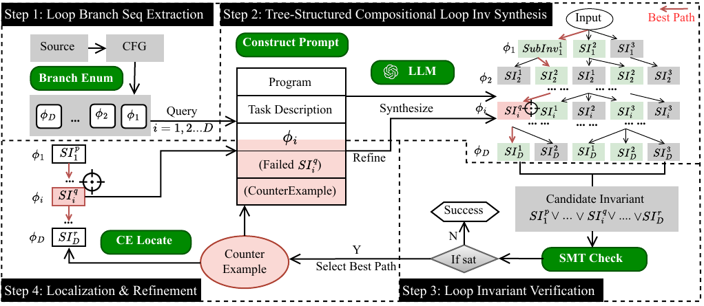

# CLOVER: Compositional Loop Invariant Inference for Multiphase Programs via Tree-Structured Neurosymbolic Reasoning

<p>
    
    
</p>

Official implementation of **CLOVER**, a compositional loop invariant inference
framework for multiphase programs. CLOVER pairs **tree-structured neural
reasoning** (an LLM exploring candidate invariants over a search tree) with
**symbolic SMT verification** (Z3) in a neurosymbolic loop.



CLOVER decomposes invariant synthesis into **branch-level reasoning**: it explores
candidate invariants per branch via a tree-structured search, composes them into a
global invariant with disjunction (`||`), and verifies the result with an SMT
solver. Failing candidates are refined using counterexamples.

---

## ⚙️ Setup

Requires **Python 3.9+** and an OpenAI API key.

```bash
# 1. Install dependencies (numpy, openai, backoff, sympy, z3-solver, ...)
pip install -r requirements.txt

# 2. Provide your OpenAI API key
export OPENAI_API_KEY="sk-..."
```

`main.py` adds `src/` to the path automatically, so you can run it directly from
the repo root — no `pip install -e .` or `PYTHONPATH` needed.

---

## 🚀 Quick Start

```bash
python main.py --to_print --category Linear --task_idx 165
```

This solves task `165` from the `Linear` benchmark, prints the intermediate
reasoning steps, and reports the final invariant, runtime, and LLM usage.

---

## 🔑 Arguments

| Argument | Default | Description |
|---|---|---|
| `--category` | `Linear` | Benchmark category: `Linear`, `NL` (non-linear), or `Multiphase` |
| `--task_idx` | `1` | Index of the benchmark task to solve |
| `--backend` | `gpt-5.1` | LLM backend (e.g. `gpt-4o`, `gpt-5.1`, `gpt-5-nano`) |
| `--temperature` | `0.9` | Sampling temperature |
| `--max_tokens` | `4096` | Max completion tokens per query |
| `--n_generate_sample` | `5` | Candidates generated per search step |
| `--n_evaluate_sample` | `3` | Evaluations per candidate |
| `--n_select_sample` | `5` | Candidates kept after selection |
| `--n_initial_refinements` | `5` | Initial refinement rounds |
| `--to_print` | off | Print detailed intermediate reasoning |

---

## 🧠 Method

CLOVER follows a branch-aware, neurosymbolic pipeline:

1. **Program analysis** — parse the program (AST + CFG).
2. **Branch extraction** — identify branch guards.
3. **Branch-wise generation** — explore candidate invariants per branch with a
   tree-structured search (propose → evaluate → select).
4. **Composition** — combine branch candidates into a global invariant with `||`.
5. **SMT verification** — validate the candidate with Z3.
6. **Refinement** — use counterexamples to refine failing branches and repeat.

---

## 📊 Benchmarks

Benchmarks live under `benchmarks/` (repo root), one directory per category:

| Category | Tasks | Description |
|---|---|---|
| `Linear` | 317 | Linear arithmetic programs |
| `NL` | 50 | Non-linear programs |
| `Multiphase` | 54 | Multi-phase loops |

Each category contains parallel subdirectories indexed by task:

- `c/` — original C source programs
- `c_branches/` — extracted branch guards
- `c_smt2/` / `c_smt/` — SMT-LIB verification encodings
- `c_graph/` — control-flow graphs (Multiphase only)

---

## 📁 Project Structure

```
main.py                          # Entry point
src/
├── models.py                    # OpenAI backend + usage accounting
├── search/bfs.py                # Tree-structured search: propose / evaluate / select / refine
├── templates/loop.py            # Prompts for invariant generation & refinement
└── core/
    ├── loop.py                  # LoopInvSolver — benchmark loading & orchestration
    ├── c_inv_checker.py         # Z3-based invariant verification
    ├── dnf_normalizer.py        # Candidate cleanup
    ├── dnf_utils_with_tests.py  # DNF normalization
    └── base.py                  # Task base class & data paths
benchmarks/                      # Linear / NL / Multiphase benchmark suites
result/                          # Precomputed invariant results per category
```

---

## 📈 Results

Precomputed runs over the full benchmark suites are provided under `result/`, one
JSON file per category:

| File | Category | Invariant found |
|---|---|---|
| `result/linear_results.json` | Linear | 311 / 316 |
| `result/nonlinear_results.json` | Non-linear | 44 / 51 |
| `result/multiphase_results.json` | Multiphase | 35 / 54 |

Each record contains the synthesized invariant (`final_answer`) and runtime; the
Linear and Non-linear files also carry an `error` field (`"None"` on success),
and the Multiphase file records token usage and estimated cost. Inspect them
with, e.g.:

```bash
python -c "import json; d=json.load(open('result/linear_results.json')); print(d[0])"
```

---

## 💡 Notes

- Use `--to_print` for detailed debugging output.
- Designed for research on loop invariant synthesis; particularly effective for
  multiphase programs.

---

## 📄 License

MIT — see [LICENSE](LICENSE).
